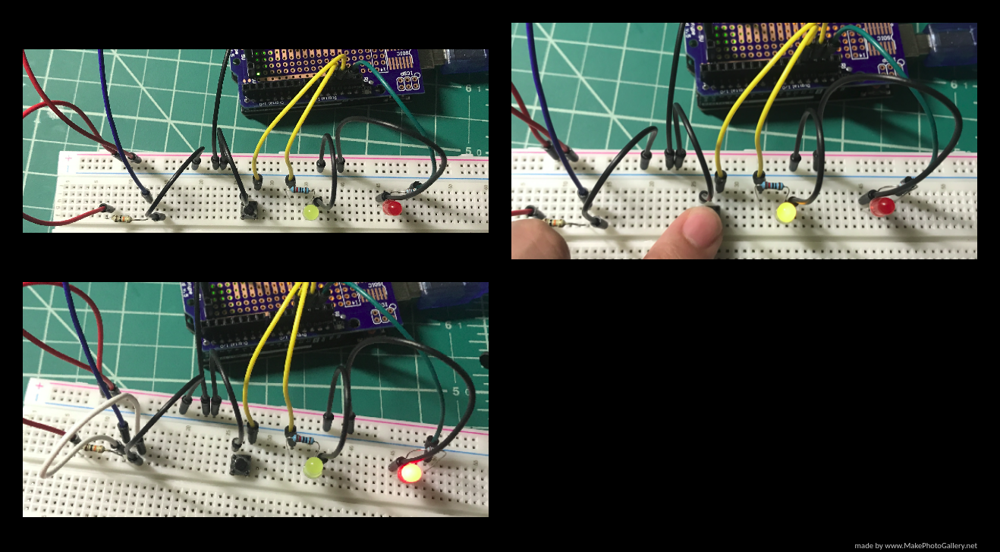

<h1>Ohmmeter-with-a-Button</h1>

<h2>Tools</h2>
<ul>
  <li>Breadboard</li>
  <li>Arduino</li>
  <li>Button</li>
  <li>2 LEDs </li>
  <li>Male to Male Jumper Wires </li>
  <li>1 10 k&#8486; resistor </li>
  <li>1 1.2 k&#8486; resistor </li>
</ul>

<h2>Motivation for the Project</h2>

I created an ohmmeter that measures the resistance of a resistor by pressing a button since the button initiates the program to start reading the resistor by supplying current to flow through the resistor I will measure. Using a voltage divider equation I can just attain the voltage of resistor, that is then used to calculate the resistance by using Ohm’s law R = V/I, in which R is the resistance, V is the voltage of the resistor, and I is the current flowing through the resistor. I wrote the code for this program completely in Arduino and utilized only the analog pins to then convert them to digital values as part of the solution for the resistance.

